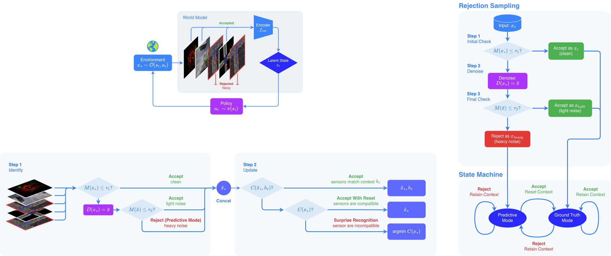
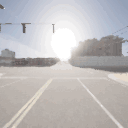
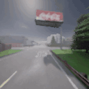
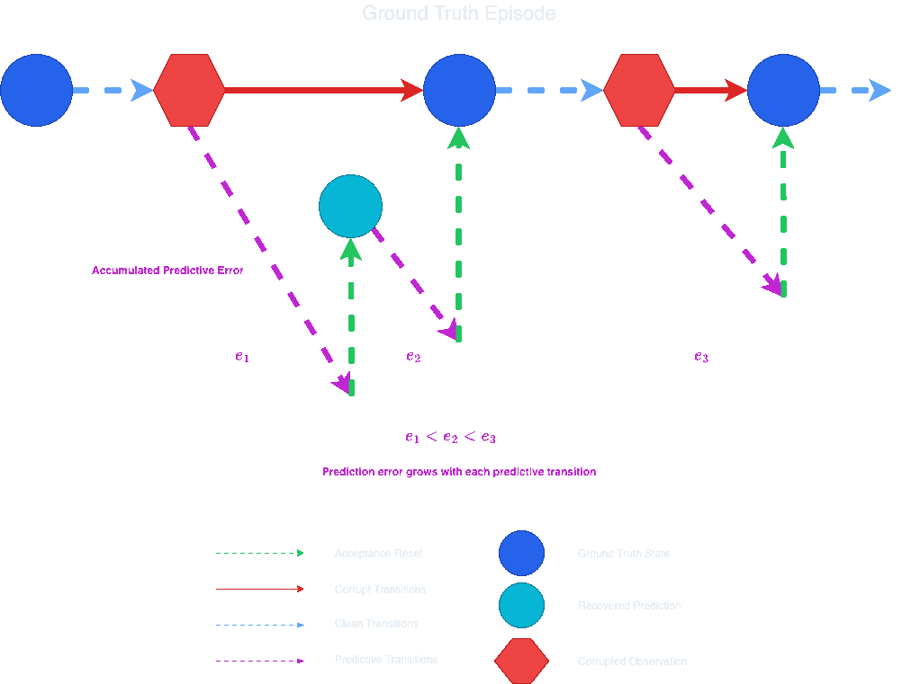
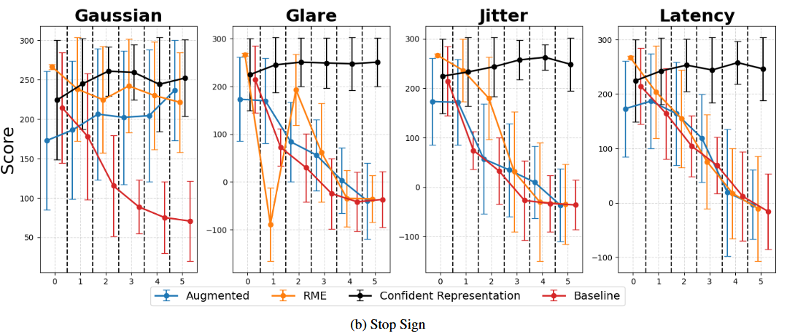
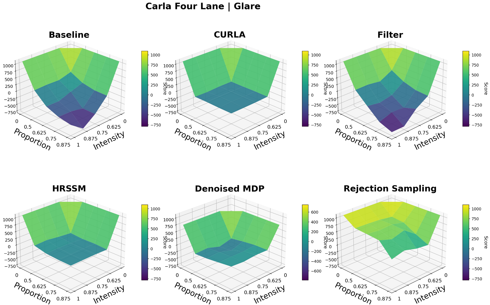
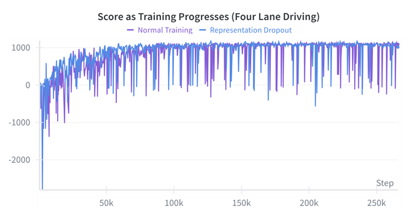
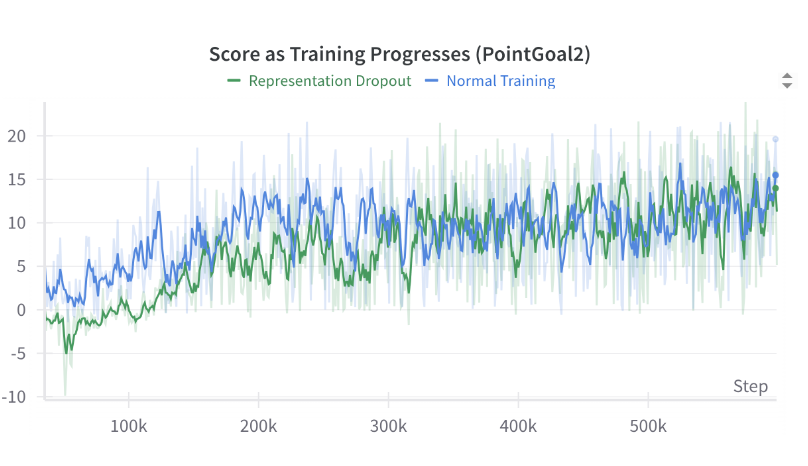
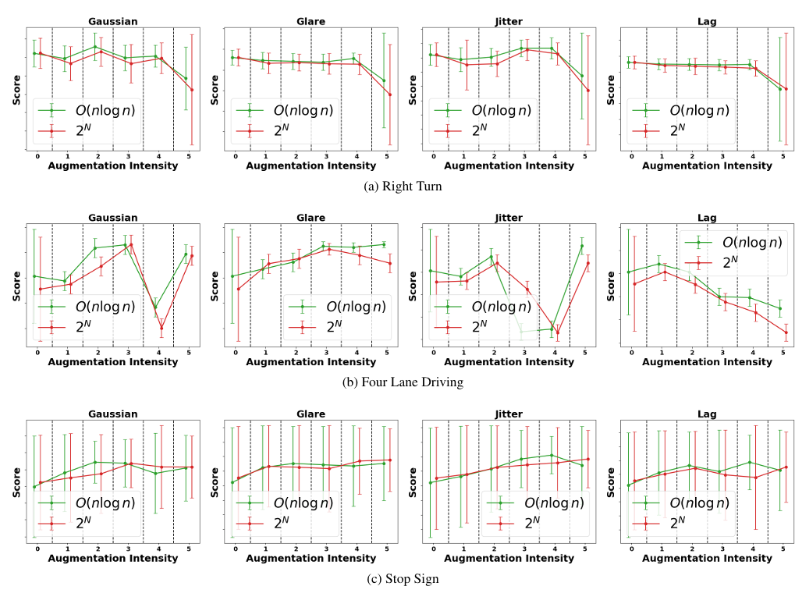
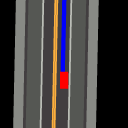

# World Model Robustness via Surprise Recognition (CVPR Findings 2026)
<div align="center">
    <a href="https://huggingface.co/GeighZ/WISER">
        
        HuggingFace Checkpoints
    </a>
    &nbsp;|&nbsp;
    <a href="https://arxiv.org/abs/2512.01119">
        
        Paper
    </a>
    &nbsp;|&nbsp;
    <a href="https://eilab.gatech.edu/WISER/project-page/">
        
        Project Page
    </a>
</div>

## Overview

**What happens when world models see corrupted observations?**

World-model agents can achieve impressive performance in simulation, but they are often fragile when observations become corrupted. Sensor noise, glare, jitter, occlusion, or out-of-distribution visual artifacts can cause the world model to make inaccurate predictions and ultimately degrade policy performance.

A central challenge is that it is impossible to anticipate every type of corruption during training. As a result, even highly capable agents may fail when deployed in environments that differ from those seen during training.

This repository explores robustness through the lens of latent corruption. Rather than assuming every observation is equally trustworthy, we utilize the world model to continuously evaluates how well incoming observations match its learned expectations. Observations that produce unusually high prediction error are treated as potentially unreliable or uninterpretable and wiser degrades gracefully before they fully corrupt the latent state leading to poor planning and control.

The approach operates during inference and can be applied to different world-model architectures, including DreamerV3 and Cosmos. We evaluate robustness across multiple self-driving environments, sensor configurations, and corruption types.

**Main idea:** If a world model cannot comprehend an observation, the agent's actions are likely unreliable. By identifying and handling these observations, agents can remain robust and stablized under noisy and out-of-distribution conditions under proper hierarical task guidance.



<center>

|                     Right Turn Simple                      |             Four Lane              |             Stop Sign              |
| :--------------------------------------------------------: | :--------------------------------: | :--------------------------------: |
|  |  |  |

</center>

## Intuition

The figure below illustrates how prediction error accumulates as predictions diverge from the reference trajectory given a sudden sensor failure and how rejection mechanisms aim to recover stable predictions and remain as close to the true trajectory as possible.



## 📋 Experimental Results

WISER improves world-model robustness by detecting uninterpretable observations and degrading gracefully unreliable during inference. We evaluate WISER across CARLA driving tasks, corrupted video generation, and sensor-subset selection settings.

### Robustness under CARLA sensor corruptions

The following results show policy performance under different sensor corruptions in CARLA. Compared with baseline and masking-based alternatives, WISER maintains stronger performance as corruption severity increases.

<p align="center">
  
</p>

### Video generation and policy improvements

WISER is not limited to policy execution. It also improves world-model video generation quality under corrupted inputs. Rejection sampling improves overall generation quality across multiple corruption types, with the largest gains under jitter and glare.

<center>

| Aug Type | Base Model | Rejection Sampling | Avg. Diff | Rel. Improvement |
| :---------- | ---------: | -----------------: | ---------: | ---------------: |
| Chrome | 0.774 | 0.808 | +0.034 | +3.13% |
| Gaussian | 0.767 | 0.810 | +0.043 | +5.00% |
| Glare | 0.726 | 0.809 | +0.083 | +11.98% |
| Jitter | 0.719 | 0.812 | +0.093 | +12.25% |
| Occlusion | 0.787 | 0.810 | +0.023 | +3.18% |
| **Overall** | **0.755** | **0.810** | **+0.055** | **+7.11%** |

</center>

<p align="center">
  
</p>

### Efficient sensor-subset search and latent robustness

WISER improves robustness in two ways: representation dropout encourages a more stable latent structure during training, while surprise-guided subset search identifies compatible sensors without exhaustively enumerating all possible sensor combinations.

#### Representation dropout training stability

<p align="center">
  
</p>
<p align="center">
  
</p>

#### Efficient sensor-subset search

WISER's surprise-guided search achieves performance comparable to exhaustive subset search while avoiding the combinatorial cost of evaluating all sensor subsets.

<p align="center">
  
</p>

## Setup

 We provide all scripts as well as instructions for additional configs that are necessary to run different World Model denoising and rejection scoring methods tailored to different research settings. In addition, we provide highly customizable noise injection to test experimental world models. In this branch (See other branches for Safety Gymnasium and Cosmos configurations), we also provide pretrained multi-sensor checkpoints (trained with and without multi-representation dropout) and single sensor checkpoints for tasks. We train Multi-Sensor and Single Sensor DreamerV3 agents on our built-in tasks with a single 4090. Depending on the observation spaces, the memory overhead ranges from 10GB-20GB alongwith 3GB reserved for CARLA.

## 📋 Prerequisites

### WISER Dependencies

To install WISER tasks or the development suite, clone the repository:

```bash
git clone https://github.com/Bluefin-Tuna/WISER.git
cd WISER
```

Download [CARLA release](https://github.com/carla-simulator/carla/releases) of version `0.9.15`. Set the following environment variables:

```bash
export CARLA_ROOT="</path/to/carla>"
export PYTHONPATH="${CARLA_ROOT}/PythonAPI/carla":${PYTHONPATH}
```

Install the package using flit. The `--symlink` flag is used to create a symlink to the package in the Python environment, so that changes to the package are immediately available without reinstallation. (`--pth-file` also works, as an alternative to `--symlink`.)

```bash
conda create python=3.10 --name wiser
conda activate wiser
pip install flit
cd dreamerv3
pip install -r requirements.txt
flit install --symlink
```

### Model Dependencies

For this branch, the model backbones are decoupled from Wiser tasks or the development suite. Users can install model dependencies on their own demands. To install DreamerV3, check out the guidelines [DreamerV3](https://github.com/eilab-gt/Wiser/tree/master/dreamerv3).

### Quick Start

### :mechanical_arm: Training

We suggest starting with Carla as we provide results for both multi-sensor settings and single-sensor settings. To train DreamerV3 agents, without representation dropout use

```bash
# Example 1: Use default settings to train an agent
bash train_dm3.sh 2000 0 --task carla_four_lane --dreamerv3.logdir ./logdir/carla_four_lane
# Example 2: Override task and model parameters
bash train_dm3.sh 2000 0 --task carla_right_turn_simple \
    --dreamerv3.logdir ./logdir/carla_right_turn_simple \
    --dreamerv3.run.steps=5e6
```
To train with representation dropout simply adjust dropout training (under run) to true in the [dreamerv3.yaml](https://github.com/eilab-gt/WISER/blob/carla/dreamerv3/dreamerv3.yaml) file:

```
dropout_training: True
```

The training/evaluation command will launch CARLA at 2000 port, load task a built-in task named `carla_four_lane`, and start the visualization tool at port 9000 (2000+7000) which can be accessed through `http://localhost:9000/`. You can append flags to the command to overwrite yaml configurations.

To customize between sensors used, be sure to assign the correct keys for the dreamerv3 model encoder and decoder keys in: [tasks.yaml](https://github.com/eilab-gt/Wiser/blob/main/car_dreamer/configs/tasks.yaml) under each specific task, for example:

```
dreamerv3:
    encoder.cnn_keys: "birdeye_wpt" #'camera|birdeye_wpt|lidar|birdeye_raw|birdeye_with_traffic_lights|birdeye_gt|...' #Used for multiple Representations
    decoder.cnn_keys: "birdeye_wpt" #'camera|birdeye_wpt|lidar|birdeye_raw|birdeye_with_traffic_lights|birdeye_gt|…' #Used for multiple Representations
```
As well as enable the observations themselves.

```
observation.enabled: [camera, collision, birdeye_wpt, ...]
```

### Creating Tasks and Adding New Noises:

The section explains how to create Wiser tasks in a standalone mode without loading our integrated models. This can be helpful **if you want to train and evaluate your own models**.

Each task class can be instantiated with various configurations. For instance, the right-turn task can be set up with simple, medium, or hard settings. These settings are defined in YAML blocks within [tasks.yaml](https://github.com/eilab-gt/Wiser/blob/main/car_dreamer/configs/tasks.yaml). The task creation API retrieves the given identifier (e.g., `carla_four_lane_hard`) from these YAML task blocks and injects the settings into the task class to create a gym task instance.

```python
# Create a gym environment with default task configurations
import car_dreamer
task, task_configs = car_dreamer.create_task('carla_four_lane_hard')

# Or load default environment configurations without instantiation
task_configs = car_dreamer.load_task_configs('carla_right_turn_hard')
```

### :rocket: Evaluation under customized noise

In addition to adjusting the tasks through [tasks.yaml](https://github.com/eilab-gt/Wiser/blob/main/car_dreamer/configs/tasks.yaml) We provide evaluation scripts that allow for selection of noise type, noise intensity, and noise proportion. For multi-sensor settings, the evaluation script signature is: 
```bash
eval_dm3_sequential.sh <port> <gpu> <checkpoint_path> <method>_<noise>_<number_of_sensors_randomly_effected:int> <task> 

# Example 1: Use default world model to evaluate glare with 3 sensor failures in a multi-sensor setting.

bash eval_dm3_sequential.sh 2000 0 ./logdir/carla_four_lane_sensor_dropout/checkpoint.ckpt Default_glare_3 carla_four_lane
```
The multi-sensor setting is compatible with ```reject``` mode (Rejection Sampling; experimental), and ```surprise``` (Surprise Recognition) mode.

For single sensor settings we utilize a float to dictate the intensity of noise and assign a proportion of the episode to be corrupted:
```bash
eval_dm3_sequential.sh <port> <gpu> <checkpoint_path> 
<method>_<noise>_proportion<proportion_of_episode:float>_timestep<timestep_to_start_noise>_<intensity_of_noise>
<task> 

# Example 2: Use default world model to evaluate chromatic aberration failure for .75 of the episode, .90 intensity starting at time step 10 within a single-sensor setting.

bash eval_dm3_sequential.sh 2000 0 ./logdir/carla_four_lane_bev/checkpoint.ckpt 
chrome_proportion.75_timestep10_.90

```
The single setting is compatible with ```reject``` mode (Rejection Sampling).

Example of noise injection and performance of the default world model:


<table width="50%" style="table-layout: fixed; border-collapse: collapse; border: none;">
  <tr style="border: none;">
    <td align="center" style="width: 33.3%; border: none;">Ground Truth</td>
    <td align="center" style="width: 33.3%; border: none;">Posterior</td>
    <td align="center" style="width: 33.3%; border: none;">Prior</td>
  </tr>
</table>


To add your own noise navigate to [carla_base_env.py](https://github.com/eilab-gt/WISER/blob/carla/car_dreamer/carla_base_env.py)
Create your noise function (keys can be adjusted):
```
def _simulate_failure(self):
    …
available_keys = []
	…
def apply_myNoise(key):
            noise = np.random.normal(20, 30, self.obs[key].shape).astype(np.uint8)
            self.obs[key] = np.clip(self.obs[key] + noise, 0, 255)
```

Then add to the set of possible noises:

```
for key in nov_keys:
  if 'myNoise' in self._config.mode:
      apply_myNoise(key)
```
	
Example of noise injected into the BEV key:
|           First Person Camera           |                       BEV                       |
| :-------------------------------------: | :---------------------------------------------: |
|  |  |


We provide full evaluation scripts for multi-sensor and single-sensor settings in the [dreamerv3](https://github.com/eilab-gt/WISER/tree/carla/dreamerv3) folder.

### Rejection Score, Denoiser, and Observation Customization
We add helpers in the [driver](https://github.com/eilab-gt/WISER/blob/carla/dreamerv3/embodied/core/driver.py) file for customizable denoisers and rejection scores. To customize, simply assign the two properties of the driver on line 30:
```
self.rejection_score_model = None
self.denoiser_model = None
```

Examples used for ablations can be found commented out.

`Wiser` also employs an `Observer-Handler` architecture to manage complex **multi-modal** observation spaces. Each handler defines its own observation space and lifecycle for stepping, resetting, or fetching information, similar to a gym environment. The agent communicates with the environment through an observer that manages these handlers.

Users can enable built-in observation handlers such as BEV, camera, LiDAR, and spectator in task configurations. Check out [common.yaml](https://github.com/eilab-gt/Wiser/blob/master/car_dreamer/configs/common.yaml) for all available built-in handlers. Additionally, users can customize observation handlers and settings to suit their specific needs.

Finally, for experiments on out-of-distribution runs and switching of hierarchical tasks i.e mandated policies in the presence of uncertainty (see Appendix for experiments), please locate [dreamer_eval_script_switch_task](https://github.com/eilab-gt/WISER/blob/carla/dreamerv3/dreamer_eval_script_switch_task.sh) for details. Note that this ablation requires two trained policies.

#### Handler Implementation

To implement new handlers for different observation sources and modalities (e.g., text, velocity, locations, or even more complex data), `Wiser` provides two methods:

1. Register a callback as a [SimpleHandler](https://github.com/eilab-gt/Wiser/blob/master/car_dreamer/toolkit/observer/handlers/simple_handler.py) to fetch data at each step.
1. For observations requiring complex workflows that cannot be conveyed by a `SimpleHandler`, create an handler maintaining the full lifecycle of that observation, similar to our built-in message, BEV, spectator handlers.


#### Observation Handler Configurations

Each handler can access yaml configurations for further customization. For example, a BEV handler setting can be defined as:

```yaml
birdeye_view:
   # Specify the handler name used to produce `birdeye_view` observation
   handler: birdeye
   # The observation key
   key: birdeye_view
   # Define what to render in the birdeye view
   entities: [roadmap, waypoints, background_waypoints, fov_lines, ego_vehicle, background_vehicles]
   # ... other settings used by the BEV handler
```

The handler field specifies which handler implementation is used to manage that observation key. Then, users can simply enable this observation in the task settings.

```yaml
your_task_name:
  env:
    observation.enabled: [camera, collision, spectator, birdeye_view]
```

#### Environment & Observer Communications

One might need transfer information from the environments to a handler to compute their observations. E.g., a BEV handler might need a location to render the destination spot. These environment information can be accessed either through cardreamer [WorldManager](https://car-dreamer.readthedocs.io/en/latest/api/toolkit.html#car_dreamer.toolkit.WorldManager) APIs, or through environment state management.

A `WorldManager` instance is passed in the handler during its initialization. The environment states are defined by an environment's `get_state()` API, and passed as parameters to handler's `get_observation()`.

```python
class MyHandler(BaseHandler):
    def __init__(self, world: WorldManager, config):
        super().__init__(world, config)
        self._world = world

def get_observation(self, env_state: Dict) -> Tuple[Dict, Dict]:
    # Get the waypoints through environment states
    waypoints = env_state.get("waypoints")
    # Get actors through the world manager API
    actors = self._world.actors
    # ...

class MyEnv(CarlaBaseEnv):
    # ...
    def get_state(self):
        return {
            # Expose the waypoints through get_state()
            'waypoints': self.waypoints,
        }
```
# :star2: Citation

If you find this repository useful, please cite this paper:

**[ArXiv paper link](https://arxiv.org/abs/2512.01119v1)**

```
@InProceedings{Zollicoffer_2026_CVPR,
    author    = {Zollicoffer, Geigh and Chopra, Tanush and Yan, Mingkuan and Ma, Xiaoxu and Eaton, Kenneth and Riedl, Mark},
    title     = {World Model Robustness via Surprise Recognition},
    booktitle = {Proceedings of the IEEE/CVF Conference on Computer Vision and Pattern Recognition (CVPR) Findings},
    month     = {June},
    year      = {2026},
    pages     = {3146-3155}
}
```

### Credits

`WISER` builds on several projects within the autonomous driving and machine learning communities.

- [gym-carla](https://github.com/cjy1992/gym-carla)
- [CarDreamer](https://github.com/ucd-dare/CarDreamer)
- [DreamerV3](https://github.com/danijar/dreamerv3)
- [CuriousReplay](https://github.com/AutonomousAgentsLab/curiousreplay)
- [Cosmos](https://arxiv.org/abs/2501.03575)
- [SafeDreamer](https://arxiv.org/abs/2307.07176)
